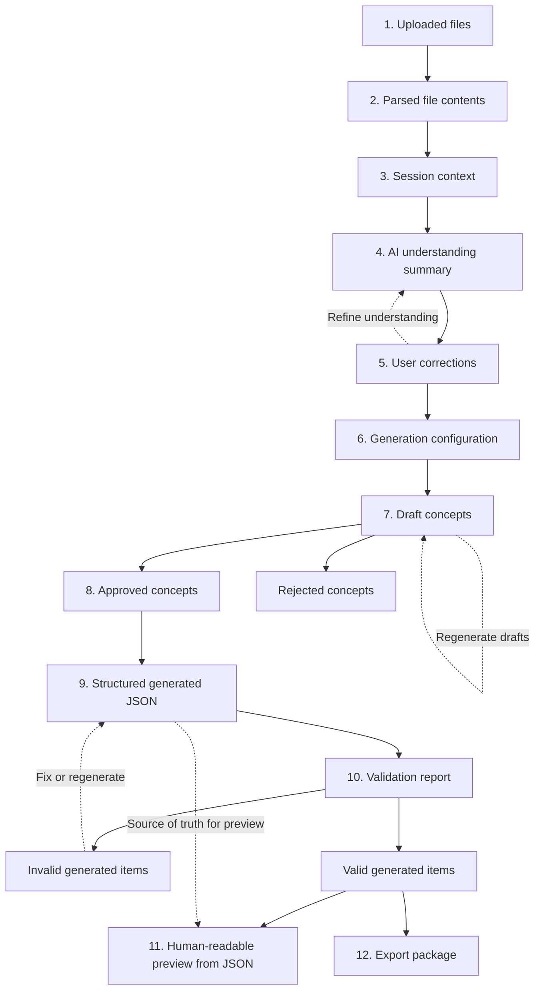

# Universal Game Content Generator — Data Flow

How data moves from uploaded files to exported JSON or ZIP.

**Rule:** Structured JSON is the source of truth. Human-readable preview is always generated from JSON, never the other way around.

## Stage descriptions

| Stage | Description |
|-------|-------------|
| Uploaded files | Raw project files with assigned roles |
| Parsed file contents | Extracted text and structured data from uploads |
| Session context | Combined session state, file metadata, and roles |
| AI understanding summary | AI interpretation of project files and constraints |
| User corrections | User-approved or edited understanding |
| Generation configuration | Element count, content type, and generation settings |
| Draft concepts | Title, short concept, and tags per item |
| Approved concepts | Concepts accepted for full JSON generation |
| Structured generated JSON | Source-of-truth content output |
| Validation report | Schema, balance, duplicate, and reference check results |
| Human-readable preview from JSON | Display layer derived only from valid JSON |
| Export package | JSON or ZIP with content, manifest, report, and summary |

## Branching rules

- **Rejected concepts** are discarded and never enter full content generation.
- **Invalid generated items** loop back to fixing or regeneration until they pass validation.
- **Valid generated items** proceed to human-readable preview and export.
- **Preview and export** always read from structured JSON, not from free-form text.
