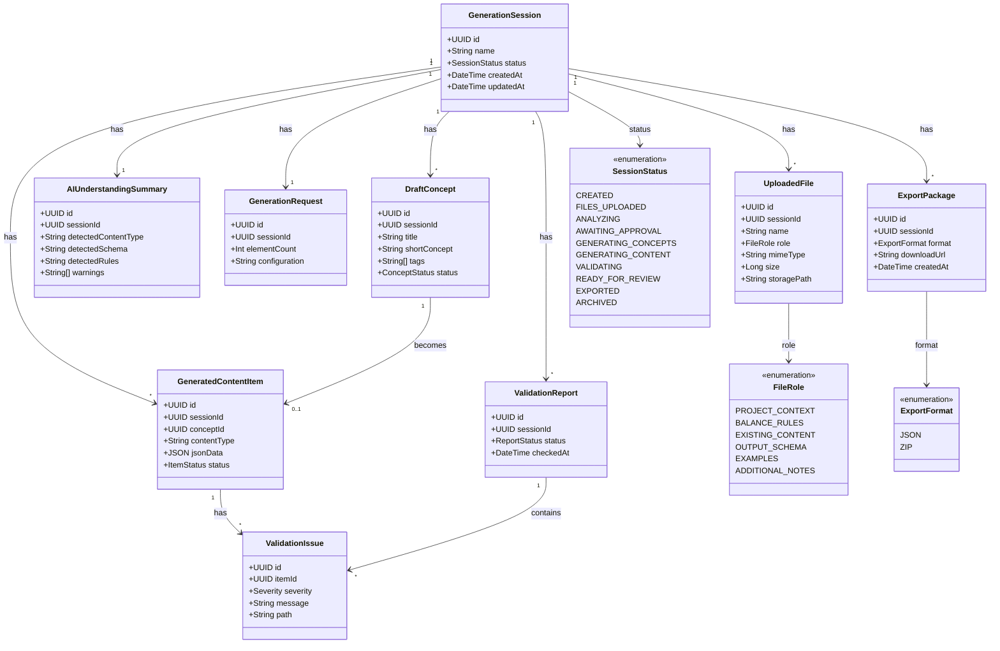

# Universal Game Content Generator — Domain Model

Main domain entities and their relationships.

## Entity overview

| Entity | Purpose |
|--------|---------|
| GenerationSession | Root aggregate for a single content generation workflow |
| UploadedFile | User-provided project file stored and assigned a role |
| FileRole | Category that tells AI how to interpret each file |
| AIUnderstandingSummary | AI interpretation of uploaded files, schema, and rules |
| GenerationRequest | User configuration for how many items to generate |
| DraftConcept | Lightweight concept (title, summary, tags) awaiting approval |
| GeneratedContentItem | Full structured JSON output for an approved concept |
| ValidationReport | Result of validating generated content for a session |
| ValidationIssue | Single validation error or warning on a content item |
| ExportPackage | Downloadable JSON or ZIP artifact for a completed session |

## Key relationships

- Only **approved** draft concepts become **GeneratedContentItem** records.
- **GeneratedContentItem.jsonData** is the source of truth; preview and export derive from it.
- **ValidationIssue** records link to both a **GeneratedContentItem** and the **ValidationReport** that recorded them.
- A session may produce multiple **ValidationReport** entries as content is fixed and revalidated.
- A session may produce multiple **ExportPackage** records (e.g. JSON-only and full ZIP).

## Supporting enumerations

**ConceptStatus:** `pending`, `approved`, `rejected`, `edited`

**ItemStatus:** `draft`, `valid`, `invalid`, `fixed`

**ReportStatus:** `passed`, `failed`, `partial`

**Severity:** `error`, `warning`, `info`
