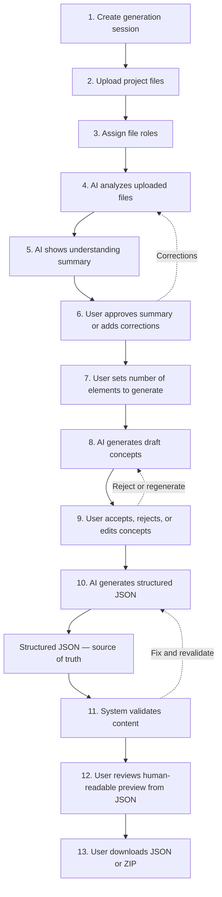

# Universal Game Content Generator — Product Flow

Main user-facing generation process from session creation to export.

**Principle:** Structured JSON is the source of truth. The human-readable preview is always generated from JSON, never the other way around.

