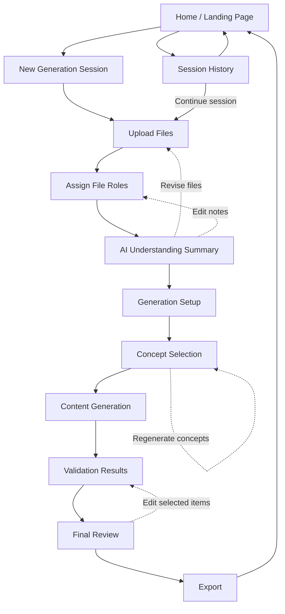

# Universal Game Content Generator — Screen Flow

Main screens and navigation paths through the web application.

## Navigation notes

| From | Loop | Destination |
|------|------|-------------|
| AI Understanding Summary | Revise files | Upload Files |
| AI Understanding Summary | Edit notes | Assign File Roles |
| Concept Selection | Regenerate concepts | Concept Selection (same screen) |
| Final Review | Edit selected items | Validation Results |

Session History lets users browse past sessions, return home, or continue an in-progress session from Upload Files.
