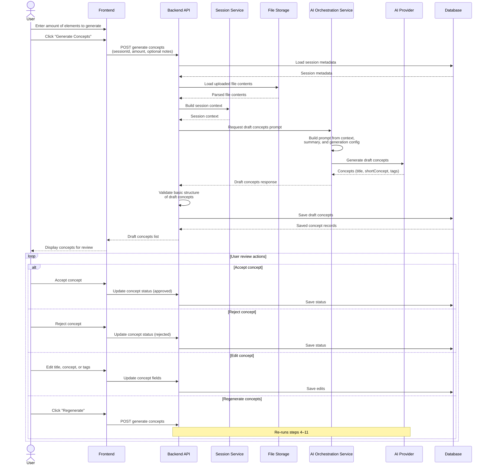

# Generate Draft Concepts — Sequence Diagram

End-to-end flow from user request to concept review.

## Steps summary

| Step | Action                                                      |
| ---- | ----------------------------------------------------------- |
| 1–2  | User sets element count and triggers generation             |
| 3    | Frontend sends `sessionId`, `amount`, and optional notes    |
| 4    | Backend loads session metadata from Database                |
| 5    | Backend loads uploaded file contents from File Storage      |
| 6    | Session Service assembles session context                   |
| 7    | AI Orchestration Service builds the draft-concepts prompt   |
| 8    | AI Provider returns title, short concept, and tags per item |
| 9    | Backend validates basic structure of returned concepts      |
| 10   | Backend persists draft concepts to Database                 |
| 11   | Frontend renders concepts for user review                   |
| 12   | User accepts, rejects, edits, or regenerates concepts       |

## Regeneration note

When the user chooses **Regenerate**, the Frontend calls the same generate-concepts endpoint and the Backend repeats loading context, calling AI, validating, saving, and returning fresh draft concepts.
