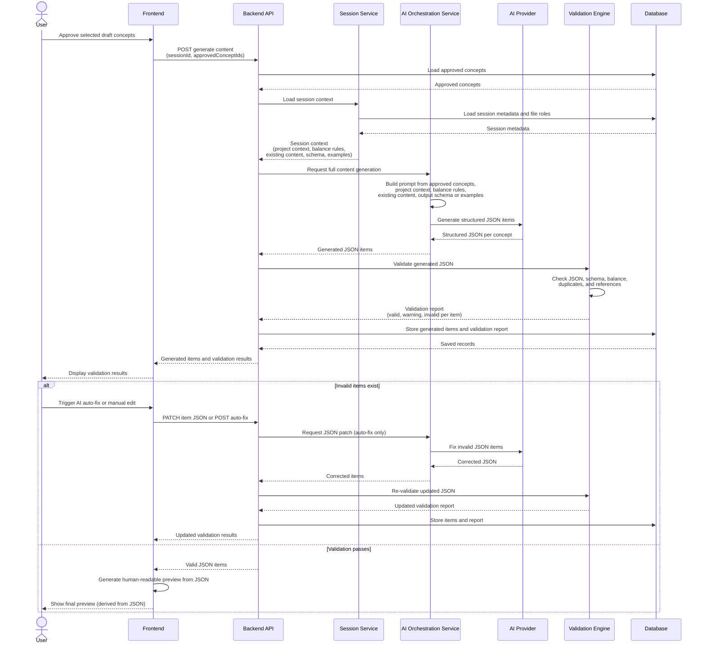

# Generate Full Structured Content — Sequence Diagram

End-to-end flow from approved concepts to validated JSON and preview.

**Principle:** Structured JSON is the source of truth. Human-readable preview is generated only after validation, from JSON — never the other way around.



## Steps summary

| Step | Action                                                                             |
| ---- | ---------------------------------------------------------------------------------- |
| 1–2  | User approves concepts; Frontend sends approved concept IDs                        |
| 3    | Backend loads approved concepts and session context                                |
| 4    | AI Orchestration builds prompt from concepts, context, rules, schema, and examples |
| 5    | AI Provider returns structured JSON items                                          |
| 6    | Backend sends generated JSON to Validation Engine                                  |
| 7    | Validation Engine checks JSON, schema, balance, duplicates, and references         |
| 8    | Backend stores generated items and validation report in Database                   |
| 9    | Frontend displays validation results                                               |
| 10   | Invalid items: user triggers AI auto-fix or manual edit, then re-validation        |
| 11   | On pass: Frontend renders preview from JSON only                                   |

## Data flow note

```
Approved concepts → AI → Structured JSON → Validation → Database → Preview (from JSON)
```

Preview and export always read from stored **jsonData**; they never drive content generation.
