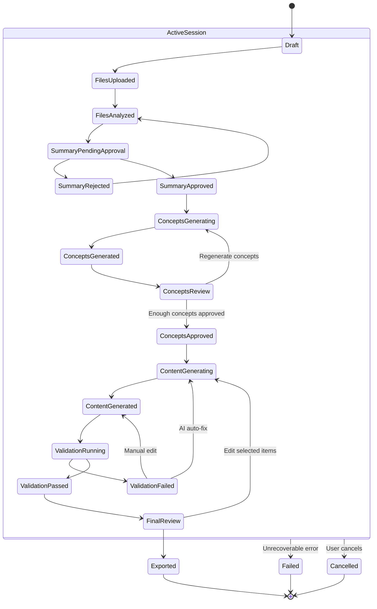

# Universal Game Content Generator — Session State

Lifecycle states and transitions for a `GenerationSession`.

## State groups

| Group                | States                                                                                     |
| -------------------- | ------------------------------------------------------------------------------------------ |
| Setup                | Draft, FilesUploaded, FilesAnalyzed                                                        |
| AI understanding     | SummaryPendingApproval, SummaryRejected, SummaryApproved                                   |
| Concepts             | ConceptsGenerating, ConceptsGenerated, ConceptsReview, ConceptsApproved                    |
| Content & validation | ContentGenerating, ContentGenerated, ValidationRunning, ValidationFailed, ValidationPassed |
| Completion           | FinalReview, Exported                                                                      |
| Terminal             | Exported, Failed, Cancelled                                                                |

## Transition notes

- **SummaryRejected** returns to **FilesAnalyzed** so the user can revise files or notes and re-run analysis.
- **ConceptsReview → ConceptsGenerating** supports regenerating draft concepts without leaving the review step permanently.
- **ValidationFailed** may return via AI auto-fix (**ContentGenerating**) or manual edit (**ContentGenerated**, then re-validation).
- **FinalReview → ContentGenerating** allows editing selected items before export.
- **Failed** and **Cancelled** are reachable from any state inside **ActiveSession** (all non-terminal workflow states).

## Terminal states

| State     | Meaning                                               |
| --------- | ----------------------------------------------------- |
| Exported  | Session completed; JSON or ZIP available for download |
| Failed    | Unrecoverable error halted the session                |
| Cancelled | User explicitly cancelled an in-progress session      |
