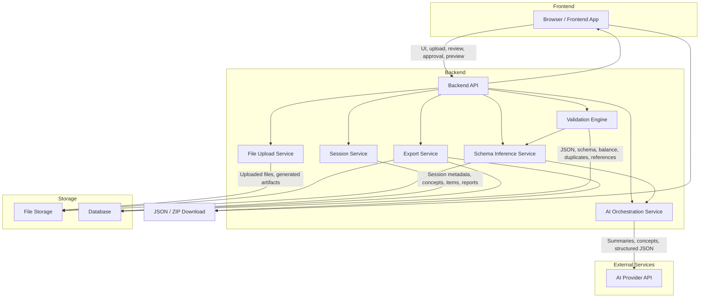

# Universal Game Content Generator — System Architecture

High-level technical architecture and component responsibilities.

## Component responsibilities

| Component                | Responsibility                                                                                 |
| ------------------------ | ---------------------------------------------------------------------------------------------- |
| Browser / Frontend App   | UI, file upload, review, approval, human-readable preview, download                            |
| Backend API              | Entry point for sessions, files, prompts, AI calls, validation, export                         |
| Session Service          | Generation session lifecycle and state                                                         |
| File Upload Service      | Accepts and stores user project files                                                          |
| File Storage             | Uploaded files and generated export artifacts                                                  |
| Database                 | Session metadata, file metadata, concepts, generated items, validation reports, export records |
| AI Orchestration Service | Prompt assembly, AI call sequencing, response handling                                         |
| AI Provider API          | Generates understanding summaries, draft concepts, structured JSON                             |
| Schema Inference Service | Detects and applies output schema from uploaded files                                          |
| Validation Engine        | JSON validity, schema, balance, duplicates, reference checks                                   |
| Export Service           | Builds JSON or ZIP packages (content, manifest, validation report, summary)                    |
| JSON / ZIP Download      | Delivers final export package to the user                                                      |

## Data flow summary

1. User interacts with the **Frontend**; requests go through the **Backend API**.
2. **Session Service** and **File Upload Service** persist metadata in the **Database** and files in **File Storage**.
3. **AI Orchestration Service** coordinates calls to the **AI Provider API**, guided by **Schema Inference Service**.
4. **Validation Engine** checks generated JSON before the user sees final preview or export.
5. **Export Service** assembles artifacts and exposes them via **JSON / ZIP Download**.
