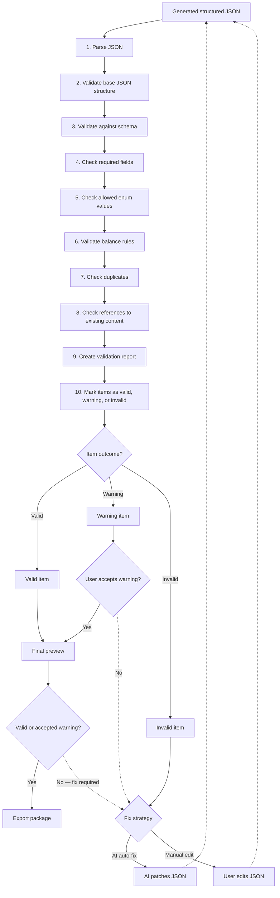

# Universal Game Content Generator — Validation Pipeline

Validation process applied after AI generates structured JSON.

**Rule:** Only valid items or items with explicitly accepted warnings can be exported.

## Pipeline steps

| Step | Check |
|------|-------|
| 1 | Parse JSON — syntactic parsing of raw output |
| 2 | Base JSON structure — objects, arrays, types |
| 3 | Schema validation — match uploaded output schema |
| 4 | Required fields — all mandatory properties present |
| 5 | Enum values — values within allowed sets |
| 6 | Balance rules — limits, formulas, caps from balance files |
| 7 | Duplicates — IDs, names, or keys already in session or existing content |
| 8 | References — foreign keys point to real existing content |
| 9 | Validation report — aggregate results per item and session |
| 10 | Item status — classify each item as valid, warning, or invalid |

## Outcome paths

| Outcome | Next step |
|---------|-----------|
| Valid | Proceed to final preview and export |
| Warning | User must explicitly accept before preview or export |
| Invalid | AI auto-fix or manual edit, then re-enter validation |

Fix loops return updated JSON to the start of the pipeline (step 1).
